

<h1>TADAM</h1>

<h3>AI-Driven Sustainability Platform</h3>

A digital sustainability platform that connects environmental reporting, community engagement, analytics, and AI-enabled decision-support.

---

## Overview

**TADAM** is an AI-driven sustainability platform designed to support environmental reporting, sustainability assessment, community engagement, analytics, and decision-making.

The platform includes a **mobile application** for users and a **web-based admin dashboard** for administrators.

TADAM helps users report environmental issues, track sustainability actions, access recycling guidance, and participate in community activities. Administrators can manage reports, monitor platform performance, analyze engagement, detect duplicate reports, and generate AI-assisted insights.

---

## Problem & Solution

Environmental issues are often reported informally or remain unnoticed, making it difficult for organizations to track, prioritize, and respond to sustainability-related concerns.

TADAM addresses this gap by providing a structured digital platform for environmental reporting, sustainability engagement, analytics, and AI-assisted decision-support.

---

## System Architecture

The architecture connects the user mobile application and admin dashboard with Firebase services, AI components, and external APIs to support reporting, analytics, authentication, media uploads, AI insights, and decision-support features.

  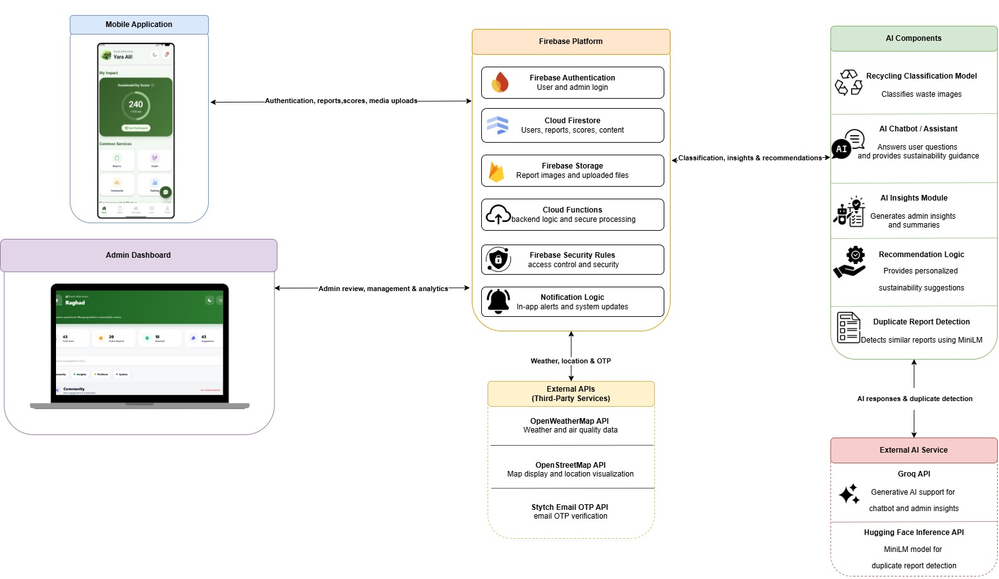

---

## Screenshots

### User Home Screens

  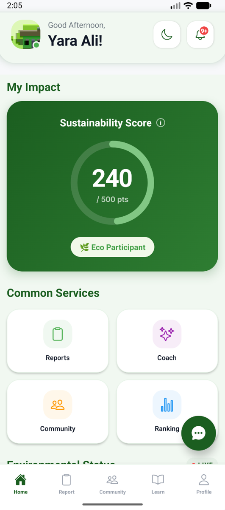
  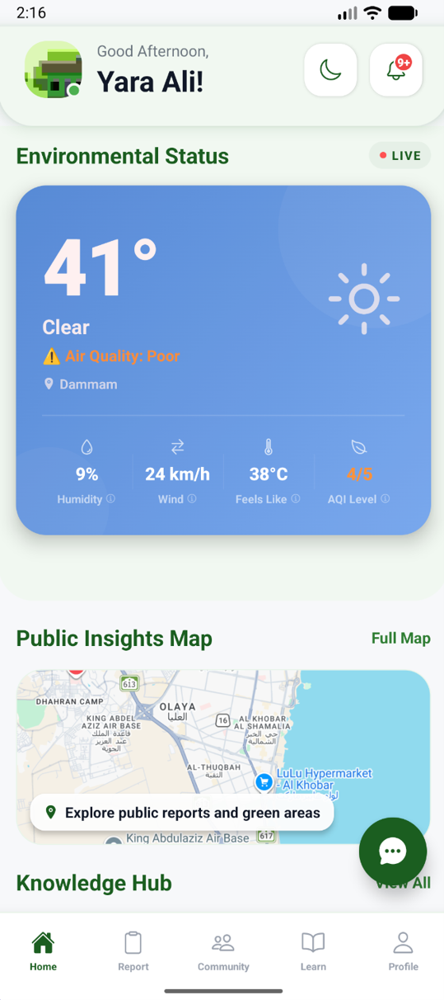

### Reporting Workflow

  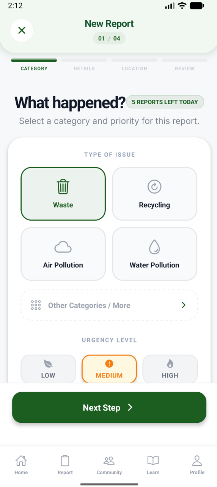
  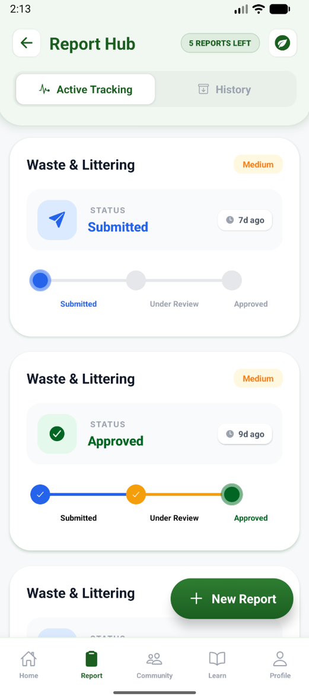

### Sustainability Score

  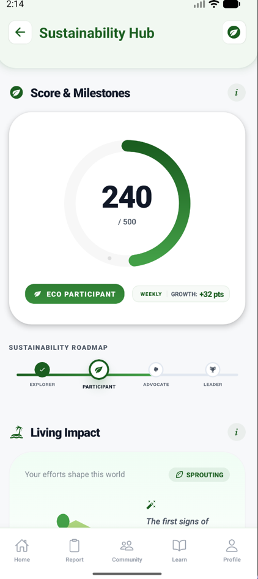
  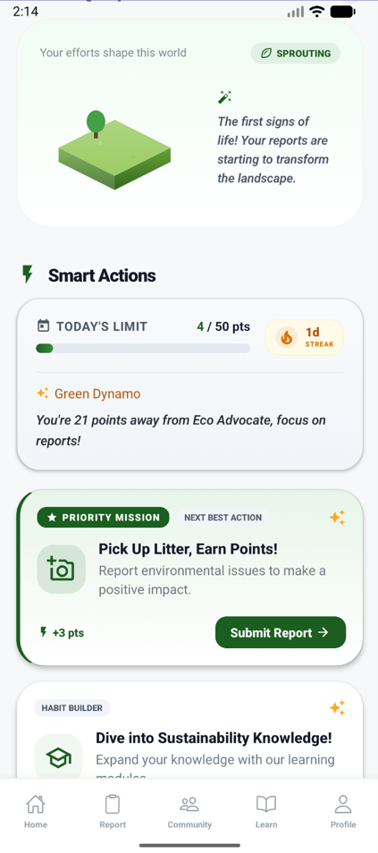
  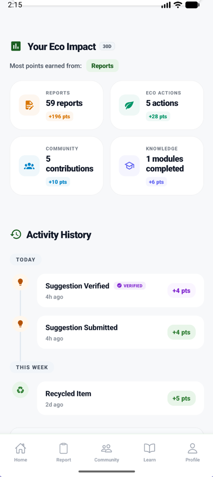

### AI Recycling Coach

  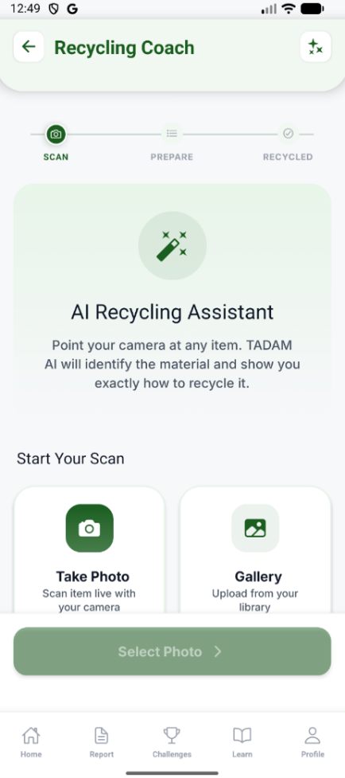
  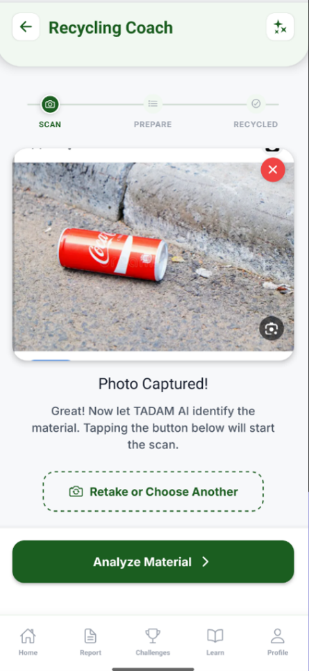
  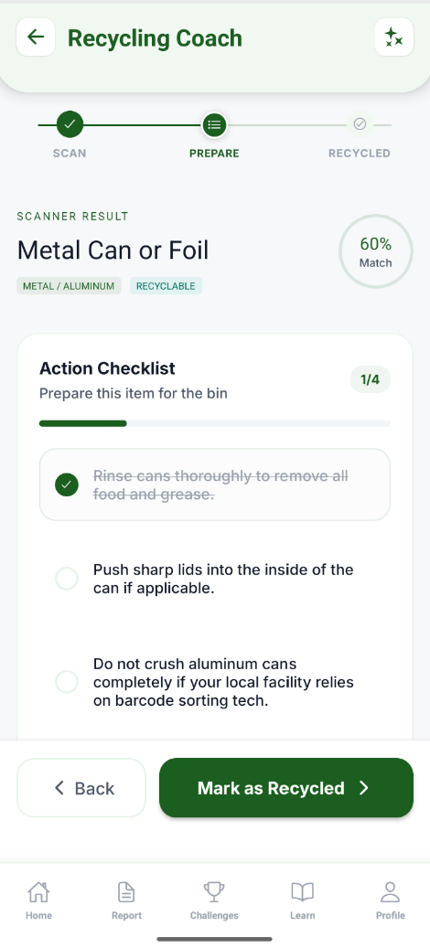

### Admin Dashboard

  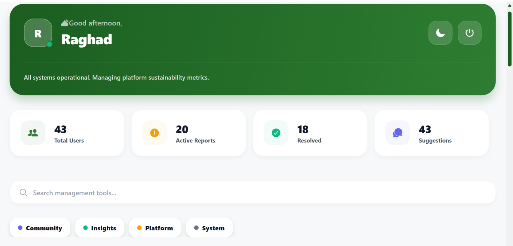

### Admin Insights & Analytics

  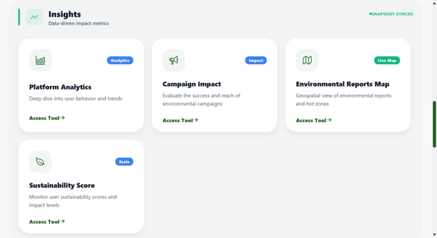

---

## Project Highlights

* Developed as a graduation project in Computer Information Systems.
* Designed with both user-facing and admin-facing experiences.
* Integrated AI-enabled features for recycling guidance, duplicate detection, chatbot support, and admin insights.
* Published as an IEEE research paper in 2026.
* Built to support sustainability reporting, engagement, analytics, and decision-making.

---

## Key Features

### User Mobile App

* Environmental report submission
* Report history and status tracking
* AI recycling coach
* Sustainability score
* Community activities
* Leaderboard
* Knowledge hub
* Interactive map
* Notifications and alerts

### Admin Dashboard

* Report management workflow
* User account management
* Platform analytics
* Sustainability activity insights
* AI monitoring
* Duplicate report detection
* Admin insights
* Report status tracking

---

## AI Model

The **AI Recycling Coach** uses a **MobileNetV2-based image classification model** trained through transfer learning and converted to **TensorFlow Lite** for mobile applications.

The model classifies uploaded recycling images and provides recycling category guidance to users.

---

## Tech Stack

### Frontend

### Backend & Database

### AI & Machine Learning

### External APIs

---

## System Modules

| Module                    | Description                                                                                                                                   |
| ------------------------- | --------------------------------------------------------------------------------------------------------------------------------------------- |
| User Mobile App           | Allows users to report environmental issues, track progress, view scores, and engage with sustainability activities.                          |
| Admin Dashboard           | Allows administrators to manage reports, users, analytics, AI monitoring, and platform insights.                                              |
| AI Recycling Coach        | Uses a MobileNetV2-based image classification model converted to TensorFlow Lite to classify recyclable items and provide recycling guidance. |
| Duplicate Detection       | Supports report review by identifying possible duplicate environmental reports.                                                               |
| Analytics Dashboard       | Displays platform performance, engagement, sustainability activity, and operational insights.                                                 |
| Decision-Support Features | Provides administrators with insights that support monitoring, prioritization, and platform management.                                       |

---

## Screenshots

> Screenshots will be added to showcase the mobile app, admin dashboard, analytics, and AI features.

<!-- Example after uploading images to an assets folder:

### Mobile App

### Admin Dashboard

### Analytics Dashboard

### AI Recycling Coach

-->

---

## My Role

As the **Graduation Project Leader**, I contributed to team coordination, documentation, project progress management, implementation, and the final presentation.

---

## Publication

**TADAM: An Artificial Intelligence Based Sustainability Assessment Framework with Community Engagement**
*IEEE, 2026*

---

## Repository Note

The source code is kept private due to **academic, team, and research ownership**.

This repository provides a high-level project overview, feature summary, technical stack, and documentation for portfolio purposes.

---

